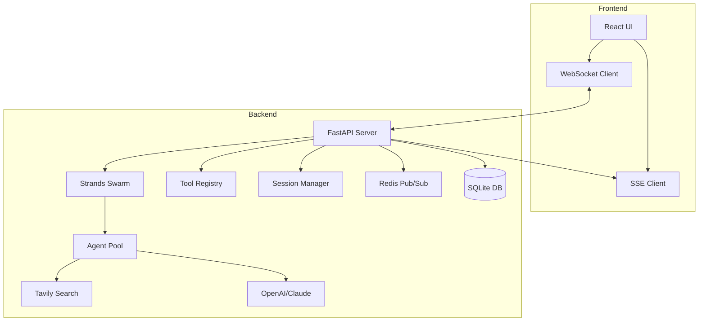

# Thrivix AI Platform - Visual AI Workflow Orchestration

<div align="center">

  <!-- Logo placeholder - add your logo here -->
  <!--  -->

  <h3>🚀 Transform natural language into executable AI workflows</h3>

[](https://github.com/rajulubheem/thrivix)
[](LICENSE)
[](https://github.com/strands-agents/sdk-python)
[](https://reactjs.org/)
[](https://fastapi.tiangolo.com/)
[](https://www.typescriptlang.org/)

[Watch Demo](https://youtu.be/WDMEXh4r6-Q) • [GitHub](https://github.com/rajulubheem/thrivix) • [Documentation](https://docs.thrivix.ai)

</div>

---

## 🎬 See It In Action

<div align="center">

  [](https://youtu.be/WDMEXh4r6-Q)

  *Click to watch: AI generates a complete microservices architecture from natural language*

</div>

## ✨ Features at a Glance

<table>
<tr>
<td width="33%" align="center">
  <b>🔄 Flow Pro</b><br/>
  <!--  -->
  <br/>AI generates & executes state machines from natural language
</td>
<td width="33%" align="center">
  <b>🔬 Research Assistant</b><br/>
  <!--  -->
  <br/>Deep analysis with web search and citations
</td>
<td width="33%" align="center">
  <b>🐝 Agent Swarm</b><br/>
  <!--  -->
  <br/>Multi-agent collaboration with live visualization
</td>
</tr>
</table>

</div>

---

## 🚀 Quick Start

```bash
# Clone and setup
git clone https://github.com/rajulubheem/thrivix.git
cd thrivix

# Backend setup
cd backend
python -m venv venv
source venv/bin/activate  # On Windows: venv\Scripts\activate
pip install -r requirements.txt

# Configure environment
cp .env.template .env
# Edit .env with your API keys

# Start backend server
uvicorn app.main:app --reload --port 8000

# Frontend setup (new terminal)
cd ../frontend
npm install
npm start
```

**Open http://localhost:3000** - You're ready to go! 🎉

---

## ✨ Core Features

### 🔄 **Flow Pro** - AI-Powered State Machine Workflow Engine
- **Task to workflow transformation**: GPT-4 analyzes your task and designs a complete state machine with phases (initialization → research → execution → validation → final)
- **Intelligent state architecture**: AI creates focused states with specific types (analysis, tool_call, decision, parallel, final) and defines all transitions (success, failure, retry, timeout)
- **Dynamic tool integration**: Each state automatically assigns appropriate tools from available options (Tavily search, file operations, etc.)
- **Real-time visual execution**: Watch agents execute the AI-generated workflow live with React Flow visualization
- **Fault-tolerant design**: Built-in retry logic, timeout handling, validation checkpoints, and rollback capabilities
- **Human-in-the-loop**: Decision states for approval workflows when human intervention is needed

### 🔬 **Research Assistant** - Advanced Conversational AI
- **Three research modes**:
  - **Fast**: Quick responses with minimal processing
  - **Deep**: Comprehensive analysis with web search and multiple sources
  - **Scholar**: Academic-style research with proper citations
- **Real-time streaming** with progressive thought display
- **Web search integration** via Tavily API for current information
- **Session persistence** to continue conversations across sessions
- **Source citations** with screenshots and links

### 🐝 **Agent Swarm** - Multi-Agent Collaboration System
- **Specialized agent roles**:
  - Research Agent (information gathering)
  - Architect Agent (system design)
  - Coder Agent (implementation)
  - Reviewer Agent (quality assurance)
  - Analyst Agent (data analysis)
- **Shared context** across all agents
- **Automatic task handoffs** between specialists
- **Parallel execution** for independent tasks
- **Human-in-the-loop** decisions when needed

### ⚡ **Efficient Swarm** - High-Performance WebSocket System
- **WebSocket-based** real-time communication
- **Minimal latency** with optimized message handling
- **Event-driven architecture** for scalability
- **Resource pooling** for efficient agent management
- **Automatic reconnection** with state recovery

### 📡 **Event-Driven Swarm** - Dynamic Agent Spawning
- **Task complexity analysis** to determine agent needs
- **Dynamic agent creation** based on requirements
- **Event-based coordination** via Redis Pub/Sub
- **Approval workflows** for critical operations
- **Audit logging** for compliance and debugging

---

## 🏗️ Architecture

### Technology Stack

| Component | Technology | Version |
|-----------|------------|---------|
| **AI Framework** | Strands Agents SDK | 1.6.0 |
| **Backend** | FastAPI + Asyncio | 0.115.0 |
| **Frontend** | React + TypeScript | 19.1.1 |
| **Flow Visualization** | React Flow + Dagre | 11.11.4 |
| **UI Components** | Radix UI + Tailwind | 3.2.1 |
| **Search Tool** | Tavily API | 0.5.0 |
| **Streaming** | WebSocket + SSE | - |
| **Event System** | Redis Pub/Sub | 5.0.7 |
| **Database** | SQLAlchemy + SQLite | 2.0.35 |
| **Authentication** | JWT + Passlib | 3.3.0 |

### System Architecture



---

## 🔧 Configuration

### Required API Keys

Create a `.env` file in the backend directory:

```env
# AI Models (Required - at least one)
OPENAI_API_KEY=sk-...
ANTHROPIC_API_KEY=sk-ant-...

# Search Tool (Required for web search features)
TAVILY_API_KEY=tvly-...

# Optional Services
REDIS_URL=redis://localhost:6379/0
DATABASE_URL=sqlite+aiosqlite:///./thrivix.db

# Application Settings
APP_NAME=Thrivix AI Platform
APP_VERSION=2.0.0
API_V1_STR=/api/v1
CORS_ORIGINS=["http://localhost:3000"]

# Performance Tuning
MAX_AGENTS_PER_SWARM=10
AGENT_TIMEOUT_SECONDS=300
MAX_CONCURRENT_TOOLS=5
```

### Frontend Configuration

The frontend automatically connects to the backend at `http://localhost:8000`. To change this:

1. Update `proxy` in `frontend/package.json`
2. Or set `REACT_APP_API_URL` environment variable

---

## 📚 API Documentation

### Core Endpoints

#### Start a Research Session
```http
POST /api/v1/conversation/start
Content-Type: application/json

{
  "message": "Research quantum computing applications",
  "mode": "deep",
  "session_id": "optional-session-id"
}
```

#### Execute Swarm Task
```http
POST /api/v1/swarm/execute
Content-Type: application/json

{
  "task": "Build a REST API for user management",
  "agents": ["researcher", "architect", "coder", "reviewer"],
  "config": {
    "max_iterations": 10,
    "enable_tools": true
  }
}
```

#### Create Visual Workflow
```http
POST /api/v1/flow-pro/create
Content-Type: application/json

{
  "description": "Create a data pipeline that fetches, processes, and visualizes data",
  "auto_generate": true
}
```

#### Stream Responses (SSE)
```http
GET /api/v1/sse/stream/{session_id}
Accept: text/event-stream
```

### WebSocket Connection
```javascript
const ws = new WebSocket('ws://localhost:8000/ws');
ws.send(JSON.stringify({
  type: 'swarm.execute',
  payload: { task: 'Analyze this code' }
}));
```

Full API documentation available at **http://localhost:8000/docs** when the server is running.

---

## 🎯 Use Cases

### 1. **Flow Pro Example: Microservices Architecture**
When you ask: *"Create a microservices architecture for a payment processing system with fault tolerance"*

GPT-4 will generate a complete state machine:
1. **Initialization** → Requirements gathering and scope analysis
2. **Parallel Research** → Simultaneous states for: API Gateway patterns, Payment Service design, Database strategies, Message Queue options
3. **Architecture Design** → Synthesize research into cohesive architecture with tool calls to Tavily for best practices
4. **Validation** → Check design against fault tolerance requirements, security standards
5. **Decision Gate** → Human approval point for the proposed architecture
6. **Documentation** → Generate implementation guides and deployment strategies
7. **Final States** → Success path with deliverables, or failure path with retry options

Each state executes with specific agents, tools, and clear transitions. Watch the workflow unfold visually as agents work through each phase.

### 2. **AI-Powered Development**
- Generate complete applications from task descriptions
- Architecture design with best practices analysis
- API design and documentation generation
- Implementation roadmaps with detailed steps

### 3. **Research & Analysis**
- Market research with competitive analysis
- Technical documentation research
- Academic paper summarization
- Data analysis and visualization

### 4. **Workflow Automation**
- CI/CD pipeline design
- Data processing workflows
- Content generation pipelines
- Report generation systems

### 5. **Team Collaboration**
- Multi-agent problem solving
- Distributed task execution
- Knowledge sharing across teams
- Approval workflows

---

## 🚦 Production Deployment

### Docker Deployment

```dockerfile
# Dockerfile included in repo
docker-compose up -d
```

### Environment Setup

```bash
# Production environment
export NODE_ENV=production
export REACT_APP_API_URL=https://api.yourdomain.com

# Backend production settings
export ENVIRONMENT=production
export LOG_LEVEL=INFO
export WORKERS=4
```

### Performance Optimization

1. **Enable Redis** for session management and caching
2. **Use PostgreSQL** instead of SQLite for production
3. **Configure CDN** for static assets
4. **Enable rate limiting** in production
5. **Set up monitoring** with Prometheus metrics

### Security Best Practices

- ✅ API key rotation policy
- ✅ HTTPS enforcement
- ✅ Rate limiting per API key
- ✅ Input validation and sanitization
- ✅ Audit logging for compliance
- ✅ Secrets management with environment variables

---

## 📈 Monitoring & Observability

### Available Metrics

- Request latency histograms
- Agent execution times
- Tool usage statistics
- Error rates by endpoint
- Active WebSocket connections
- Memory and CPU usage

### Health Checks

```bash
# Basic health check
curl http://localhost:8000/health

# Readiness check (includes DB connectivity)
curl http://localhost:8000/ready

# Metrics endpoint (Prometheus format)
curl http://localhost:8000/metrics
```

---

## 🧪 Testing

```bash
# Backend tests
cd backend
pytest tests/ -v --cov=app

# Frontend tests
cd frontend
npm test

# E2E tests
npm run test:e2e
```

---

## 🐛 Troubleshooting

### Common Issues

| Issue | Solution |
|-------|----------|
| **WebSocket disconnects** | Check CORS settings and firewall rules |
| **Slow responses** | Increase `AGENT_TIMEOUT_SECONDS` |
| **Search not working** | Verify Tavily API key is valid |
| **Memory issues** | Reduce `MAX_AGENTS_PER_SWARM` |
| **Session loss** | Enable Redis for persistent sessions |

### Debug Mode

```bash
# Enable debug logging
export LOG_LEVEL=DEBUG
export FASTAPI_DEBUG=true

# View real-time logs
tail -f logs/thrivix.log
```

---

## 🤝 Contributing

We welcome contributions! See [CONTRIBUTING.md](CONTRIBUTING.md) for guidelines.

### Development Setup

```bash
# Install dev dependencies
pip install -r requirements-dev.txt
npm install --save-dev

# Run linters
black backend/
npm run lint

# Pre-commit hooks
pre-commit install
```

---

## 📄 License

Apache License 2.0 - see [LICENSE](LICENSE) file for details.

---

## 🙏 Acknowledgments

- **[Strands SDK](https://github.com/strands-agents/sdk-python)** - Production-ready multi-agent orchestration
- **[Tavily](https://tavily.com)** - Advanced search API
- **[React Flow](https://reactflow.dev)** - Interactive flow diagrams
- **[Radix UI](https://radix-ui.com)** - Accessible UI components
- **OpenAI & Anthropic** - AI model providers

---

<div align="center">
  <strong>Built with ❤️ by the Thrivix Team</strong>
  <br>
  <sub>Empowering developers with visual AI workflow orchestration</sub>
  <br><br>
  <a href="https://github.com/rajulubheem/thrivix/issues">Report Bug</a>
  ·
  <a href="https://github.com/rajulubheem/thrivix/discussions">Request Feature</a>
  ·
  <a href="https://docs.thrivix.ai">Documentation</a>
</div>