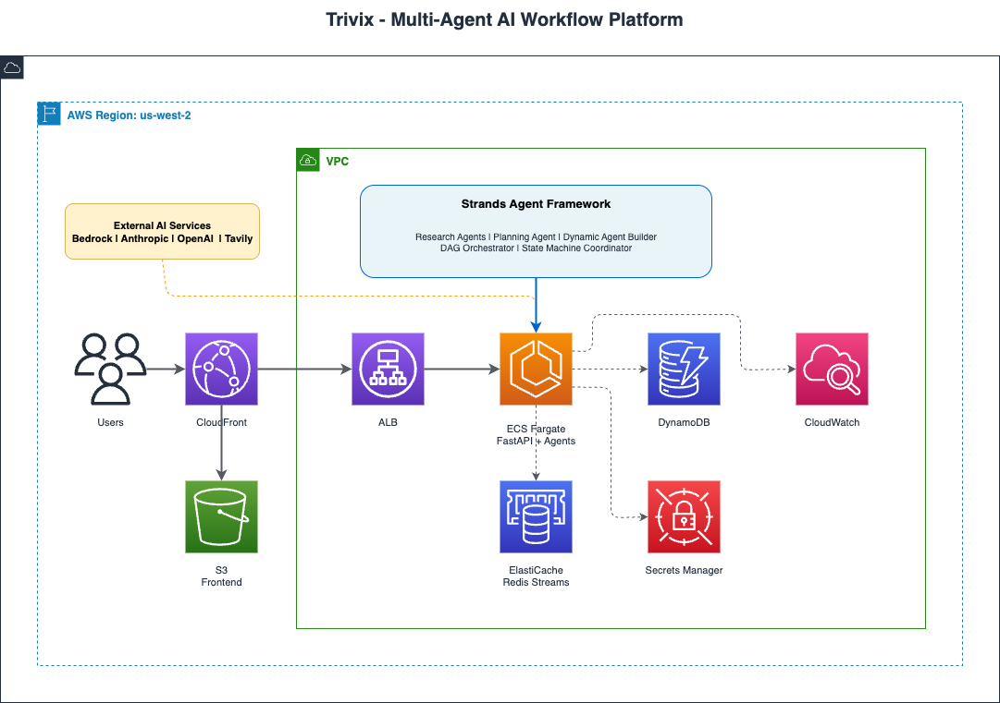

# Thrivix

<div align="center">

[](https://github.com/rajulubheem/thrivix)
[](https://www.python.org/)
[](https://reactjs.org/)
[](LICENSE)

### **Build Visual AI Workflows with Real-Time Execution**

Design state machines, orchestrate agent swarms, and watch AI execute complex tasks—all in your browser.

[Watch Demo](https://youtu.be/WDMEXh4r6-Q) • [GitHub](https://github.com/rajulubheem/thrivix)

</div>

---

## 🎯 What is Thrivix?

Thrivix is a **visual workflow platform** for building and executing AI-powered workflows. Create state machines with drag-and-drop blocks, orchestrate multiple AI agents, and monitor execution in real-time with interactive diagrams.

**Three Ways to Build:**

1. **Flow Pro** - Design state machines visually with nodes and edges
2. **Agent Swarm** - Deploy multi-agent teams that collaborate on tasks
3. **Research Assistant** - Conversational AI with web search and citations

---

## 🚀 Core Features

### 1. Flow Pro - Visual State Machine Designer

Build complex workflows with a drag-and-drop interface powered by ReactFlow:

- **100+ Tool Blocks** - Web search, code execution, file ops, data processing
- **Agent Blocks** - AI-powered decision makers with specialized roles
- **Visual Execution** - Watch state transitions and tool usage in real-time
- **Parallel Execution** - Run multiple branches simultaneously
- **Resume from Failures** - Restart from any state when errors occur

**Use Cases:**
```
Research Pipeline:  Web Search → Extract Data → Analyze → Generate Report
Code Review Flow:   Read Files → Run Tests → Security Scan → Document
Data Pipeline:      Fetch API → Transform → Visualize → Export
```

### 2. Agent Swarm - Multi-Agent Collaboration

Deploy specialized AI agents that work together:

- **Specialized Roles** - Research, coding, analysis, documentation agents
- **Context Sharing** - Agents see outputs from previous agents
- **Real-Time Streaming** - Watch agents work with live updates
- **Session Management** - Persistent conversations with history

**How It Works:**
```
User Task: "Analyze competitor pricing strategies"

→ Research Agent: Searches web for pricing data
→ Analysis Agent: Processes and compares data
→ Visualization Agent: Creates charts and graphs
→ Summary Agent: Writes executive summary
```

### 3. Research Assistant - AI Chat with Tools

Conversational interface with three research modes:

- **Fast Mode** - Quick GPT-4 responses (< 5 seconds)
- **Deep Mode** - Web research + multi-source synthesis (10-30s)
- **Scholar Mode** - Academic rigor with citations (30-60s)

Features: Web search via Tavily, streaming responses, conversation history, source tracking.

---

## 🎬 See It In Action

<div align="center">

<table>
<tr>
<td width="33%" align="center">
  <b>Flow Pro</b><br/>
  <a href="https://youtu.be/WDMEXh4r6-Q">
    
  </a>
  <br/>Visual workflow builder
</td>
<td width="33%" align="center">
  <b>Research Mode</b><br/>
  <a href="https://youtu.be/SHlG25Bw-w8">
    
  </a>
  <br/>Web search & analysis
</td>
<td width="33%" align="center">
  <b>Agent Swarm</b><br/>
  <a href="https://youtu.be/bzpWFTz18do">
    
  </a>
  <br/>Multi-agent collaboration
</td>
</tr>
</table>

</div>

---

## 🛠️ Real-World Examples

### Software Development
**Workflow: Code Review Pipeline**
1. File Reader Block → Reads codebase files
2. Test Runner Block → Executes test suite
3. Security Scan Block → Checks vulnerabilities
4. Documentation Agent → Generates API docs
5. Summary Agent → Creates review report

### Business Analysis
**Workflow: Market Research**
1. Web Search Block → Gathers industry data (Tavily)
2. Data Extraction Block → Parses key metrics
3. Python REPL Block → Statistical analysis
4. Visualization Block → Charts and graphs
5. Report Writing Agent → Executive summary

### Content Creation
**Agent Swarm: Technical Documentation**
- Research Agent → Finds latest best practices
- Outline Agent → Structures the document
- Writing Agent → Drafts sections
- Code Agent → Creates examples
- Review Agent → Checks accuracy

---

## 🚀 Quick Start

### Local Development

**Prerequisites:**
- Python 3.11+
- Node.js 18+
- Redis (required)

**Installation:**

```bash
# Clone repository
git clone https://github.com/rajulubheem/thrivix.git
cd thrivix

# Install Redis
# macOS:
brew install redis && brew services start redis
# Linux:
# sudo apt-get install redis-server && sudo systemctl start redis

# Setup backend
cd backend
python3 -m venv venv
source venv/bin/activate  # Windows: venv\Scripts\activate
pip install -r requirements.txt
cp .env.template .env

# Add API keys to backend/.env:
# OPENAI_API_KEY=your_key
# TAVILY_API_KEY=your_key

# Start backend (Terminal 1)
uvicorn app.main:app --reload --port 8000

# Setup frontend (Terminal 2)
cd frontend
npm install
npm start
```

Open **http://localhost:3000**

---

### ☁️ AWS Cloud Deployment

Deploy Thrivix to AWS with **one-command CDK deployment**. All infrastructure is managed as code with automatic resource discovery.

**Prerequisites:**
- AWS Account with CLI configured
- AWS CDK installed (`npm install -g aws-cdk`)
- Docker (for building container images)

**Step 1: Configure Deployment**

```bash
cd infrastructure

# Copy template and fill in your AWS details
cp deployment-config.template.json deployment-config.json

# Edit deployment-config.json:
# - Set your AWS account ID
# - Choose region (default: us-west-2)
# - Configure CORS origins
```

**Step 2: Create Secrets**

```bash
# One-time: Create AWS Secrets Manager secret
aws secretsmanager create-secret \
  --name thrivix-fargate-secrets \
  --description "API keys for Thrivix" \
  --secret-string '{"OPENAI_API_KEY":"your-key","ANTHROPIC_API_KEY":"your-key","TAVILY_API_KEY":"your-key"}' \
  --region us-west-2

# Or use the helper script:
cd infrastructure/cdk-fargate
./update-secrets.sh
```

**Step 3: Deploy Infrastructure**

```bash
# Deploy backend (ECS Fargate + ALB + Redis + DynamoDB)
cd infrastructure/cdk-fargate
npx cdk bootstrap  # First time only
npx cdk deploy

# Deploy frontend (S3 + CloudFront)
cd ../cdk-frontend
npx cdk deploy
```

**What Gets Deployed:**
- ✅ **VPC** - Private network with 2 AZs and NAT gateways
- ✅ **ECS Fargate** - Serverless containers with auto-scaling (2-10 tasks)
- ✅ **ALB** - Application Load Balancer with health checks
- ✅ **ElastiCache Redis** - Event streaming backbone
- ✅ **DynamoDB** - Session state storage
- ✅ **CloudFront + S3** - Global CDN for frontend
- ✅ **Secrets Manager** - Secure API key storage
- ✅ **CloudWatch** - Logs and metrics (6-month retention)

**Security Features:**
- 🔒 No hardcoded AWS account IDs or endpoints in git
- 🔒 Automatic ALB discovery via CloudFormation exports
- 🔒 All secrets in AWS Secrets Manager (not environment variables)
- 🔒 Encrypted data at rest (KMS) and in transit (TLS)
- 🔒 VPC isolation with private subnets

**Cost Estimate:** ~$80-120/month
- ECS Fargate (2 tasks): ~$35/month
- ElastiCache t3.micro: ~$12/month
- ALB: ~$18/month
- NAT Gateways: ~$32/month
- CloudFront + S3: ~$5-10/month

**Update Your Deployment:**

When you get a new AWS account or need to reconfigure:

```bash
# 1. Edit infrastructure/deployment-config.json with new account ID
# 2. Update secrets in new account
# 3. Redeploy both stacks

cd infrastructure/cdk-fargate
npx cdk deploy

cd ../cdk-frontend
npx cdk deploy
```

**AWS Architecture:**



The diagram shows the complete AWS infrastructure including VPC, ECS Fargate, ALB, Redis, DynamoDB, CloudFront, and S3.

**Deployment Scripts:**
- `./infrastructure/deploy.sh` - One-command deployment
- `./infrastructure/pause-services.sh` - Pause/resume services to save costs

---

## 🏗️ Architecture

```
┌─────────────────────────────────────────┐
│         React Frontend (Port 3000)      │
│  ┌──────────┐ ┌──────────┐ ┌─────────┐ │
│  │Flow Pro  │ │ Research │ │  Swarm  │ │
│  │(ReactFlow)│ │  Chat   │ │Interface│ │
│  └──────────┘ └──────────┘ └─────────┘ │
└──────────────────┬──────────────────────┘
                   │ WebSocket + REST
┌──────────────────▼──────────────────────┐
│      FastAPI Backend (Port 8000)        │
│  ┌──────────────────────────────────┐  │
│  │   Strands Agents SDK             │  │
│  │   - Agent Orchestration          │  │
│  │   - State Machine Engine         │  │
│  │   - Tool Registry (100+ tools)   │  │
│  └──────────────────────────────────┘  │
└──────────────────┬──────────────────────┘
                   │
        ┌──────────┼──────────┐
        │          │          │
   ┌────▼───┐ ┌───▼───┐ ┌───▼────┐
   │OpenAI  │ │ Redis │ │ Tavily │
   │ GPT-4  │ │Pub/Sub│ │ Search │
   └────────┘ └───────┘ └────────┘
```

**Tech Stack:**
- **Backend:** FastAPI, Strands Agents SDK, Redis, WebSocket/SSE
- **Frontend:** React 19, ReactFlow, Tailwind CSS, Radix UI
- **AI:** OpenAI GPT-4, Tavily Search API
- **Tools:** 100+ dynamic tools (web, code, file, data processing)

---

## 📝 Configuration

### API Keys Required

Edit `backend/.env`:

```env
OPENAI_API_KEY=your_openai_key        # Required
TAVILY_API_KEY=your_tavily_key        # Required for web search
ANTHROPIC_API_KEY=your_key            # Optional
REDIS_URL=redis://localhost:6379/0    # Default
```

**Get API Keys:**
- OpenAI: https://platform.openai.com/api-keys
- Tavily: https://tavily.com (free tier: 1000 searches/month)

### System Requirements

- **Python 3.11+** (async features)
- **Node.js 18+** (React 19 support)
- **Redis** (required for real-time streaming)
- **8GB RAM** (recommended)
- **2GB disk** (dependencies)

---

## 🎯 What Makes Thrivix Different?

### Compared to AI Chat Tools (ChatGPT, Claude)

| Feature | Thrivix | AI Chat |
|---------|---------|---------|
| **Visual Workflows** | ✅ Interactive diagrams | ❌ Text only |
| **Reusable Pipelines** | ✅ Save & replay | ❌ Manual copy-paste |
| **Execution Visibility** | ✅ Watch tools run | ❌ Black box |
| **Multi-Agent Coordination** | ✅ Parallel agents | ❌ Single thread |
| **Resume Failed Tasks** | ✅ From any state | ❌ Start over |
| **Tool Integration** | ✅ 100+ built-in tools | ⚠️ Limited |

### Compared to Workflow Tools (n8n, Zapier)

| Feature | Thrivix | Workflow Tools |
|---------|---------|----------------|
| **AI-Powered Nodes** | ✅ LLM agents with context | ⚠️ Simple automations |
| **Dynamic Workflows** | ✅ Agents decide paths | ❌ Fixed routes |
| **Real-Time Visualization** | ✅ Live execution view | ⚠️ Logs only |
| **Natural Language** | ✅ Describe tasks | ❌ Configure manually |
| **Agent Collaboration** | ✅ Multi-agent swarms | ❌ Sequential steps |

### Key Strengths

1. **Visual + Intelligent** - Workflows that think, displayed beautifully
2. **Real-Time Transparency** - See exactly what AI is doing
3. **Flexible Execution** - State machines, swarms, or chat—your choice
4. **Developer-Friendly** - ReactFlow-based UI, FastAPI backend, clean architecture

---

## 📦 Available Routes

Access different interfaces at:

- **`/`** - Landing page with feature overview
- **`/flow-pro`** - Visual state machine designer (main feature)
- **`/swarm`** - Multi-agent collaboration interface
- **`/conversation`** - Research assistant chat
- **`/settings`** - Configuration panel
- **`/orchestrator`** - Unified orchestrator (experimental)

---

## 🚧 Roadmap

### In Development
- [ ] AWS Bedrock integration (Claude, Llama)
- [ ] Workflow templates library
- [ ] Enhanced error recovery
- [ ] Agent performance metrics
- [ ] Workflow sharing/export

### Future Plans
- [ ] Local LLM support (Ollama)
- [ ] Custom tool builder
- [ ] Team collaboration features
- [ ] Cloud hosting option
- [ ] Workflow marketplace

---

## 🐛 Known Limitations

- Requires OpenAI + Tavily API keys (paid services)
- Redis must be running for streaming features
- Complex workflows can take 30-60 seconds
- Currently single-user (no auth/multi-tenancy)
- Some experimental interfaces may have bugs

---

## 🤝 Contributing

Contributions welcome! Priority areas:

1. **Bug Fixes** - Stability improvements
2. **Documentation** - Tutorials, examples
3. **Tool Integrations** - New blocks and capabilities
4. **UI/UX** - Better visualizations
5. **Performance** - Optimization for large workflows

```bash
# Fork and clone
git checkout -b feature/your-feature
git commit -m "Add: description"
git push origin feature/your-feature
```

---

## 📄 License

Apache License 2.0 - See [LICENSE](LICENSE)

Free to use commercially, modify, distribute, and use privately.

---

## 🙏 Built With

- **[Strands Agents SDK](https://github.com/strands-agents/sdk-python)** - Multi-agent orchestration
- **[OpenAI API](https://openai.com)** - GPT-4 language models
- **[Tavily Search](https://tavily.com)** - Web search API
- **[React Flow](https://reactflow.dev)** - Interactive node diagrams
- **[FastAPI](https://fastapi.tiangolo.com)** - Python web framework

---

## 📞 Support

- **Issues:** [GitHub Issues](https://github.com/rajulubheem/thrivix/issues)
- **Discussions:** [GitHub Discussions](https://github.com/rajulubheem/thrivix/discussions)

---

<div align="center">

**Build AI workflows that you can see, understand, and control.**

[⭐ Star this repo](https://github.com/rajulubheem/thrivix) if you find it useful!

</div>
